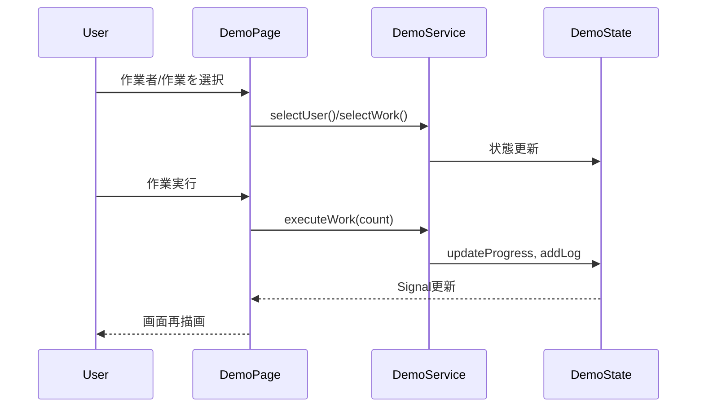

# Angular Demo アプリケーション

## 概要
このリポジトリには Angular で構築されたデモアプリケーションが含まれています。利用者は作業(作業A/B/C)と作業者を選択し、作業を実行・完了・キャンセルできます。処理状況や操作ログは状態として管理され、画面に表示されます。

## フォルダ構成
```
/ (本リポジトリ)
├── AGENTS.md
└── demo/                   # Angular プロジェクトルート
    ├── package.json        # 依存関係
    └── src/app/
        ├── domain/
        │   ├── service/    # ビジネスロジック
        │   └── state/      # 状態管理 (global/local)
        ├── pages/          # ページコンポーネント
        └── view/           # Stateless View コンポーネント
```

## アーキテクチャ
- **Viewコンポーネント** (`view` 配下) は入力プロパティとイベントのみを扱う純粋な表示層です。
- **Service** (`domain/service`) はビジネスロジックを実装し、状態の変更を仲介します。
- **State** (`domain/state`) は Signal を用いた状態管理を担い、外部には読み取り専用として公開されます。
- **Pageコンポーネント** (`pages`) は View と Service を橋渡しするコンテナコンポーネントです。

## 主要クラスと役割
- **DemoServiceInterface** – サービスが提供する操作を定義します (`executeWork`, `completeWork` など)【F:demo/src/app/domain/service/demo-service-interface.ts†L4-L14】
- **DemoState** – 作業種別、作業者、進捗、ログを Signal として保持し、進捗更新やログ追加を行います【F:demo/src/app/domain/state/global/demo-global.state.ts†L19-L59】
- **DemoPage** – 選択された作業に応じてサービス実装を切り替え、View コンポーネントのイベントをサービスメソッドへマッピングします【F:demo/src/app/pages/demo-page/demo-page.ts†L17-L135】
- **DemoView** – 受け取った状態を表示し、ボタン操作や選択イベントを外部に伝播します【F:demo/src/app/view/demo-view/demo-view.ts†L16-L60】

## 依存関係
主要な依存パッケージ:
- `@angular/core`, `@angular/common`, `@angular/forms`, `@angular/platform-browser`, `@angular/router`
- `rxjs`, `tslib`
詳細は `demo/package.json` を参照してください【F:demo/package.json†L22-L31】

## 処理フロー (シーケンス図)


## テスト
依存環境 (ChromeHeadless) が不足しているため単体テストは実行できませんでした。【e1af6a†L20-L27】
